# B1-1. 시스템 관제 자동화 스크립트 개발 수행내역서

## 기능 요구 사항

### 1. 기본 보안 및 네트워크 설정

#### 1.1 SSH 설정

##### 1.1.1 수행 내역

1. `ubuntu-b11` 환경에서 `sshd` 설치 여부를 확인하였다.
2. `sshd`가 설치되어 있지 않아 `sudo apt-get update`를 실행하였다.
3. `sudo apt-get install -y openssh-server`로 OpenSSH 서버를 설치하였다.
4. 제출 저장소에 `config/99-b11-hardening.conf` 파일을 만들었다.
5. 해당 설정 파일에 `Port 20022`를 작성하여 SSH 접속 포트를 20022번으로 지정하였다.
6. 같은 설정 파일에 `PermitRootLogin no`를 작성하여 Root 원격 로그인을 차단하였다.
7. `/etc/ssh/sshd_config.d/` 디렉터리를 생성하고 설정 파일을 배포하였다.
8. `sudo sshd -t`로 SSH 설정 문법 오류가 없는지 확인하였다.
9. Ubuntu 24.04 환경에서 기본 `ssh.socket`이 22번 포트를 잡고 있어 `sudo systemctl disable --now ssh.socket`으로 비활성화하였다.
10. `sudo systemctl enable ssh.service`로 SSH 서비스를 부팅 시 자동 실행되도록 등록하였다.
11. `sudo systemctl restart ssh.service`로 변경된 설정을 적용하였다.
12. `sshd_config.d` 설정 파일에서 `Port 20022`, `PermitRootLogin no`가 들어간 것을 확인하였다.
13. `sudo sshd -T`로 실제 적용된 설정도 `port 20022`, `permitrootlogin no`임을 확인하였다.
14. `sudo ss -tulnp`로 `sshd`가 `0.0.0.0:20022`와 `[::]:20022`에서 LISTEN 상태임을 확인하였다.

##### 1.1.2 주요 개념

- SSH란? 원격 서버에 암호화된 방식으로 접속하기 위한 프로토콜이며, 서버 관리에 자주 사용된다.
- `PermitRootLogin`이란? root 계정의 SSH 직접 접속 허용 여부를 정하는 설정이다. `no`로 설정하면 root 직접 접속을 막아 보안을 높일 수 있다.
- `ss`란? 소켓 통계(Socket Statistics)를 확인하는 도구로, 네트워크 연결 상태를 보여주는 `netstat`의 대체 도구로 널리 사용된다.

##### 1.1.3 확인 결과

- SSH 포트 변경: `20022` 적용 완료
- Root 원격 접속 차단: `PermitRootLogin no` 적용 완료
- SSH 서비스 상태: `active`, `enabled`
- 포트 리슨 상태: `sshd`가 `20022/tcp`에서 LISTEN 중

##### 1.1.4 증거 자료

SSH 설정 파일 및 실제 적용 설정 확인:

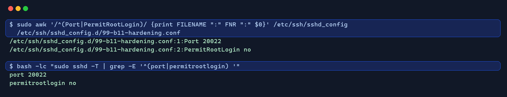

SSH 서비스 상태 및 포트 리슨 확인:

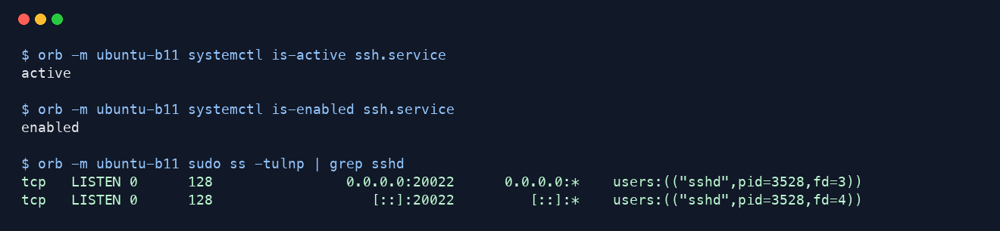

원문 증거 로그:

- `evidence/01_ssh_config_check.txt`
- `evidence/02_ssh_port_listen_check.txt`

#### 1.2 방화벽 설정

##### 1.2.1 수행 내역

1. `ubuntu-b11` 환경에서 `ufw`와 `firewall-cmd` 설치 여부를 확인하였다.
2. 두 도구가 모두 설치되어 있지 않아, 과제 확인 방법이 간단한 UFW를 선택하였다.
3. `sudo apt-get install -y ufw`로 UFW를 설치하였다.
4. `sudo ufw default deny incoming`으로 외부에서 들어오는 기본 연결을 차단하였다.
5. `sudo ufw default allow outgoing`으로 서버에서 외부로 나가는 연결은 허용하였다.
6. `sudo ufw allow 20022/tcp`로 SSH 접속용 포트만 허용하였다.
7. `sudo ufw allow 15034/tcp`로 애플리케이션 실행 포트만 허용하였다.
8. `sudo ufw --force enable`로 방화벽을 활성화하고 부팅 시에도 적용되도록 하였다.
9. `sudo ufw status verbose`로 방화벽 상태가 `active`인지 확인하였다.
10. 같은 출력에서 기본 정책이 `deny (incoming)`이고 허용 포트가 `20022/tcp`, `15034/tcp`만 있는지 확인하였다.
11. `sudo ufw status numbered`로 등록된 인바운드 허용 규칙을 번호 목록으로 다시 확인하였다.

##### 1.2.2 주요 개념

- UFW란? Uncomplicated Firewall의 약자로, 복잡한 방화벽 규칙을 간단한 명령어로 관리할 수 있게 해주는 Ubuntu의 방화벽 도구이다.
- 인바운드 규칙이란? 외부에서 서버 내부로 들어오는 네트워크 접속을 허용하거나 차단하는 규칙이다.
- 최소 허용 정책이란? 필요한 포트만 열어두고 나머지 접근은 차단하여 공격 가능성을 줄이는 보안 방식이다.

##### 1.2.3 확인 결과

- 방화벽 도구 선택: UFW
- 방화벽 상태: `active`
- 기본 인바운드 정책: `deny`
- 허용된 인바운드 포트: `20022/tcp`, `15034/tcp`
- IPv6 규칙도 동일하게 `20022/tcp`, `15034/tcp`만 허용됨

##### 1.2.4 증거 자료

UFW 활성화 상태 및 허용 포트 확인:

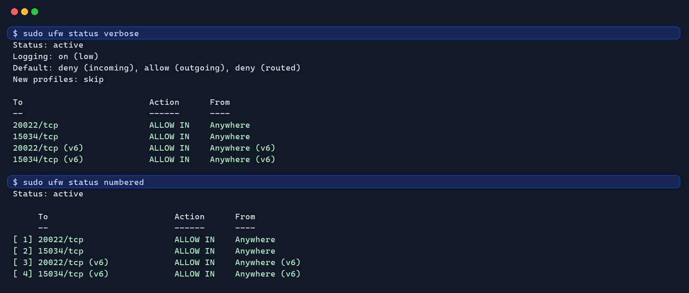

원문 증거 로그:

- `evidence/03_ufw_firewall_status_check.txt`

### 2. 계정/그룹/권한 체계

#### 2.1 생성 계정

##### 2.1.1 수행 내역

1. `ubuntu-b11` 환경에서 `getent passwd agent-admin`, `getent passwd agent-dev`, `getent passwd agent-test`로 기존 계정 존재 여부를 확인하였다.
2. 세 계정이 아직 존재하지 않는 것을 확인하였다.
3. `sudo useradd -m -s /bin/bash agent-admin`으로 운영/관리 및 cron 실행 담당 계정을 생성하였다.
4. `sudo useradd -m -s /bin/bash agent-dev`로 개발/운영 및 `monitor.sh` 작성 담당 계정을 생성하였다.
5. `sudo useradd -m -s /bin/bash agent-test`로 QA/테스트 담당 계정을 생성하였다.
6. `id agent-admin`, `id agent-dev`, `id agent-test`로 각 계정의 UID, GID, 기본 그룹을 확인하였다.
7. `getent passwd agent-admin agent-dev agent-test`로 세 계정의 홈 디렉터리와 로그인 shell이 등록되었는지 확인하였다.
8. `ls -ld /home/agent-admin /home/agent-dev /home/agent-test`로 각 계정의 홈 디렉터리가 생성되었는지 확인하였다.

##### 2.1.2 주요 개념

- 사용자 계정이란? 리눅스에서 사람 또는 서비스가 시스템 자원에 접근할 때 사용하는 기본 단위이다.
- UID/GID란? UID는 사용자 식별 번호, GID는 그룹 식별 번호로 리눅스가 권한을 판단할 때 사용한다.
- 최소 권한 원칙이란? 계정마다 필요한 역할만 부여하고 불필요한 관리자 권한은 주지 않는 보안 원칙이다.

##### 2.1.3 확인 결과

- `agent-admin` 계정 생성 완료: 운영/관리 및 cron 실행자 역할
- `agent-dev` 계정 생성 완료: 개발/운영 및 `monitor.sh` 작성자 역할
- `agent-test` 계정 생성 완료: QA/테스트 역할
- 세 계정 모두 `/home/<계정명>` 홈 디렉터리와 `/bin/bash` shell을 가진 일반 사용자로 생성됨
- 현재 단계에서는 sudo 권한을 추가하지 않아 불필요한 관리자 권한을 부여하지 않음

##### 2.1.4 증거 자료

계정 생성 여부, UID/GID, 홈 디렉터리 확인:

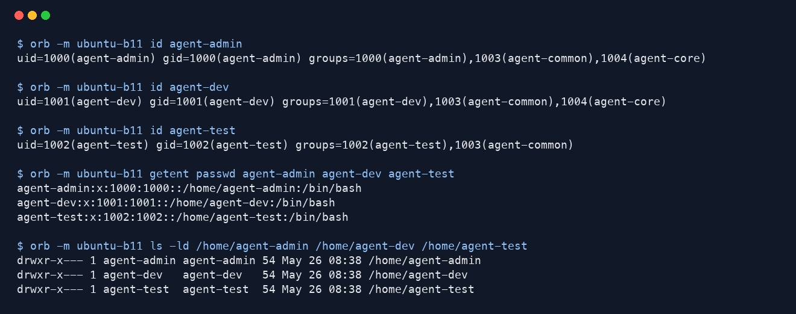

원문 증거 로그:

- `evidence/04_user_accounts_check.txt`

#### 2.2 생성 그룹

##### 2.2.1 수행 내역

1. `getent group agent-common`과 `getent group agent-core`로 기존 그룹 존재 여부를 확인하였다.
2. 두 그룹이 아직 존재하지 않는 것을 확인하였다.
3. `sudo groupadd agent-common`으로 공통 협업용 그룹을 생성하였다.
4. `sudo groupadd agent-core`로 핵심 운영 자원 접근용 그룹을 생성하였다.
5. `sudo usermod -aG agent-common agent-admin`으로 `agent-admin`을 `agent-common` 그룹에 추가하였다.
6. `sudo usermod -aG agent-common agent-dev`로 `agent-dev`를 `agent-common` 그룹에 추가하였다.
7. `sudo usermod -aG agent-common agent-test`로 `agent-test`를 `agent-common` 그룹에 추가하였다.
8. `sudo usermod -aG agent-core agent-admin`으로 `agent-admin`을 `agent-core` 그룹에 추가하였다.
9. `sudo usermod -aG agent-core agent-dev`로 `agent-dev`를 `agent-core` 그룹에 추가하였다.
10. `getent group agent-common agent-core`로 두 그룹의 구성원이 요구사항대로 등록되었는지 확인하였다.
11. `id agent-admin`, `id agent-dev`, `id agent-test`로 각 사용자의 실제 보조 그룹 소속을 확인하였다.

##### 2.2.2 주요 개념

- 그룹이란? 여러 사용자에게 같은 권한을 한 번에 부여하기 위해 사용하는 리눅스 권한 관리 단위이다.
- 보조 그룹이란? 사용자의 기본 그룹 외에 추가로 소속되는 그룹이며, 공유 디렉터리 접근 권한을 줄 때 활용된다.
- `usermod -aG`란? 기존 그룹 소속을 유지하면서 사용자를 새 보조 그룹에 추가하는 명령이다.

##### 2.2.3 확인 결과

- `agent-common` 그룹 생성 완료: `agent-admin`, `agent-dev`, `agent-test` 포함
- `agent-core` 그룹 생성 완료: `agent-admin`, `agent-dev` 포함
- `agent-test`는 `agent-core`에 포함하지 않아 핵심 자원 접근 대상을 제한함
- 역할별 그룹을 분리하여 협업 영역과 핵심 운영 영역을 나눌 준비를 완료함

##### 2.2.4 증거 자료

그룹 생성 여부 및 사용자별 그룹 소속 확인:

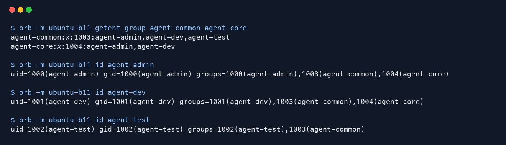

원문 증거 로그:

- `evidence/05_user_groups_check.txt`

#### 2.3 디렉토리 구조

##### 2.3.1 수행 내역

1. 과제 예시를 참고하여 `AGENT_HOME` 기준 경로를 `/home/agent-admin/agent-app`으로 정하였다.
2. `test -d /home/agent-admin/agent-app`로 앱 홈 디렉터리 존재 여부를 확인하였다.
3. `test -d /home/agent-admin/agent-app/upload_files`로 업로드 디렉터리 존재 여부를 확인하였다.
4. `test -d /home/agent-admin/agent-app/api_keys`로 키 파일 보관 디렉터리 존재 여부를 확인하였다.
5. `test -d /var/log/agent-app`로 앱 로그 디렉터리 존재 여부를 확인하였다.
6. 네 디렉터리가 아직 없는 것을 확인하였다.
7. `sudo install -d -o agent-admin -g agent-admin -m 750 /home/agent-admin/agent-app`으로 `AGENT_HOME` 디렉터리를 생성하였다.
8. `sudo install -d -o agent-admin -g agent-admin -m 750 /home/agent-admin/agent-app/upload_files`로 업로드 파일 디렉터리를 생성하였다.
9. `sudo install -d -o agent-admin -g agent-admin -m 750 /home/agent-admin/agent-app/api_keys`로 API 키 디렉터리를 생성하였다.
10. `sudo install -d -o root -g root -m 755 /var/log/agent-app`로 애플리케이션 로그 디렉터리를 생성하였다.
11. `ls -ld`로 `AGENT_HOME`, `upload_files`, `api_keys`, `/var/log/agent-app`가 모두 생성되었는지 확인하였다.
12. `find` 명령으로 앱 홈 하위 디렉터리 구조와 `/var/log/agent-app` 경로를 다시 확인하였다.

##### 2.3.2 주요 개념

- `AGENT_HOME`이란? 애플리케이션 실행에 필요한 파일과 하위 디렉터리를 모아두는 기준 경로이다.
- `install -d`란? 디렉터리를 만들면서 소유자, 그룹, 권한을 함께 지정할 수 있는 명령이다.
- 로그 디렉터리란? 애플리케이션 실행 기록이나 관제 결과를 저장하는 전용 위치이다.

##### 2.3.3 확인 결과

- `AGENT_HOME` 생성 완료: `/home/agent-admin/agent-app`
- 업로드 디렉터리 생성 완료: `/home/agent-admin/agent-app/upload_files`
- API 키 디렉터리 생성 완료: `/home/agent-admin/agent-app/api_keys`
- 로그 디렉터리 생성 완료: `/var/log/agent-app`
- 이번 단계에서는 디렉터리 구조 생성을 완료하였고, 그룹별 접근 권한은 다음 권한 설정 단계에서 세부 조정할 예정이다.

##### 2.3.4 증거 자료

`AGENT_HOME` 기준 디렉터리 구조 및 로그 디렉터리 확인:

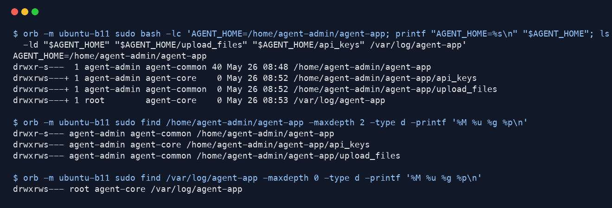

원문 증거 로그:

- `evidence/06_directory_structure_check.txt`

#### 2.4 접근 권한

##### 2.4.1 수행 내역

1. `command -v getfacl`과 `command -v setfacl`로 ACL 확인 도구 설치 여부를 확인하였다.
2. ACL 도구가 설치되어 있지 않아 `sudo apt-get install -y acl`로 `acl` 패키지를 설치하였다.
3. `id agent-admin`, `id agent-dev`, `id agent-test`로 각 계정의 그룹 소속을 다시 확인하였다.
4. `/home/agent-admin`은 다른 사용자에게 기본 접근이 막혀 있으므로 `sudo setfacl -m g:agent-common:x /home/agent-admin`으로 필요한 경로 탐색 권한만 부여하였다.
5. `sudo chown agent-admin:agent-common /home/agent-admin/agent-app`으로 `AGENT_HOME`의 그룹을 공통 그룹 기준으로 맞추었다.
6. `sudo chmod 2750 /home/agent-admin/agent-app`으로 그룹이 읽고 들어갈 수 있게 하고, setgid 비트를 적용하였다.
7. `sudo chown agent-admin:agent-common /home/agent-admin/agent-app/upload_files`로 `upload_files`의 그룹을 `agent-common`으로 지정하였다.
8. `sudo chmod 2770 /home/agent-admin/agent-app/upload_files`로 `agent-common` 그룹 구성원이 읽고 쓸 수 있게 설정하였다.
9. `sudo chown agent-admin:agent-core /home/agent-admin/agent-app/api_keys`로 `api_keys`의 그룹을 `agent-core`로 지정하였다.
10. `sudo chmod 2770 /home/agent-admin/agent-app/api_keys`로 `agent-core` 그룹만 읽고 쓸 수 있게 설정하였다.
11. `sudo chown root:agent-core /var/log/agent-app`로 로그 디렉터리 그룹을 `agent-core`로 지정하였다.
12. `sudo chmod 2770 /var/log/agent-app`로 `agent-core` 그룹만 로그 디렉터리에 읽기/쓰기 가능하도록 설정하였다.
13. `setfacl -d`로 `upload_files`, `api_keys`, `/var/log/agent-app`에 기본 ACL을 설정하여 새 파일도 그룹 권한을 유지하도록 하였다.
14. `ls -ld`로 각 디렉터리의 소유자, 그룹, 권한을 확인하였다.
15. `getfacl`로 ACL 및 기본 ACL 적용 상태를 확인하였다.
16. `agent-admin`, `agent-dev`, `agent-test` 계정으로 `upload_files` 쓰기 테스트를 하여 세 계정 모두 쓰기 가능함을 확인하였다.
17. `agent-admin`, `agent-dev` 계정으로 `api_keys` 쓰기 테스트를 하여 `agent-core` 구성원만 쓰기 가능함을 확인하였다.
18. `agent-test` 계정으로 `api_keys` 쓰기 테스트를 하여 접근이 거부되는 것을 확인하였다.
19. `agent-admin`, `agent-dev` 계정으로 `/var/log/agent-app` 쓰기 테스트를 하여 `agent-core` 구성원만 쓰기 가능함을 확인하였다.
20. `agent-test` 계정으로 `/var/log/agent-app` 쓰기 테스트를 하여 접근이 거부되는 것을 확인하였다.

##### 2.4.2 주요 개념

- R/W 권한이란? 읽기(Read)와 쓰기(Write) 권한을 의미하며, 디렉터리에서는 파일 목록 확인과 파일 생성/수정에 영향을 준다.
- ACL이란? 기본 소유자/그룹/기타 권한보다 세밀하게 접근 권한을 지정할 수 있는 리눅스 권한 기능이다.
- setgid 디렉터리란? 디렉터리 안에 새 파일을 만들 때 부모 디렉터리의 그룹을 이어받게 하는 설정이다.

##### 2.4.3 확인 결과

- `upload_files`: 그룹 `agent-common`, 권한 `rwx`로 설정되어 `agent-admin`, `agent-dev`, `agent-test` 모두 R/W 가능
- `api_keys`: 그룹 `agent-core`, 권한 `rwx`로 설정되어 `agent-admin`, `agent-dev`만 R/W 가능
- `/var/log/agent-app`: 그룹 `agent-core`, 권한 `rwx`로 설정되어 `agent-admin`, `agent-dev`만 R/W 가능
- `agent-test`는 `agent-core`에 속하지 않기 때문에 `api_keys`와 `/var/log/agent-app` 쓰기가 거부됨
- `other` 권한은 `---`로 두어 그룹 외 사용자의 접근을 차단함

##### 2.4.4 증거 자료

계정 그룹 소속, 디렉터리 소유/권한, ACL 확인:

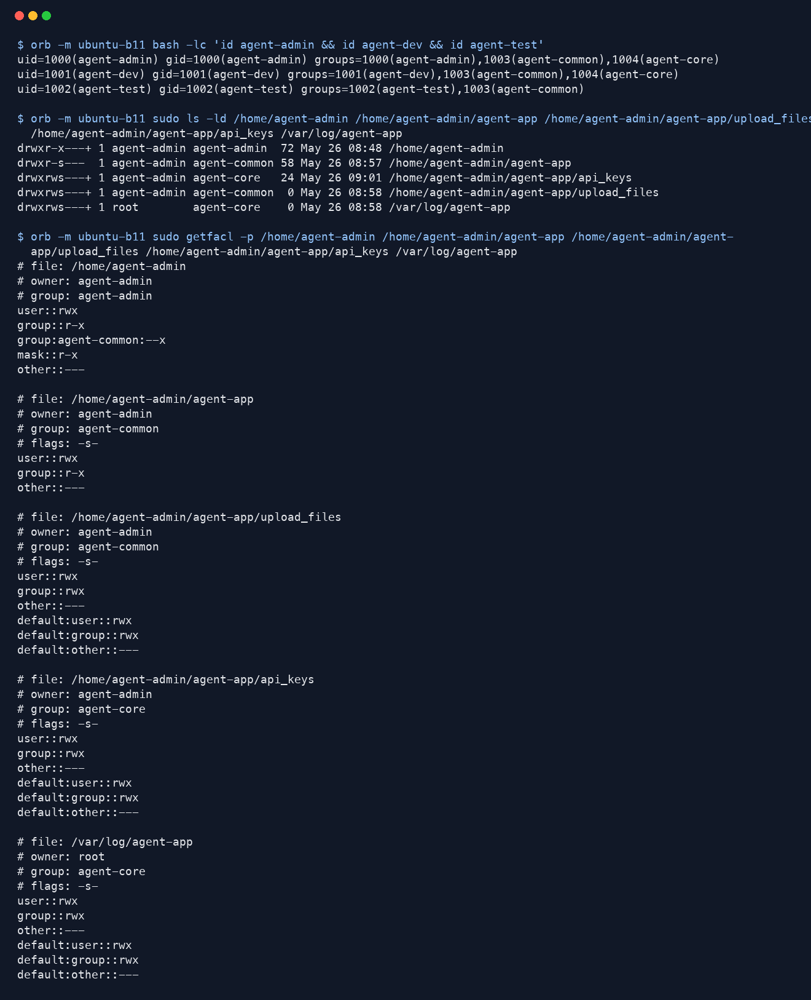

사용자별 쓰기 가능 여부 확인:

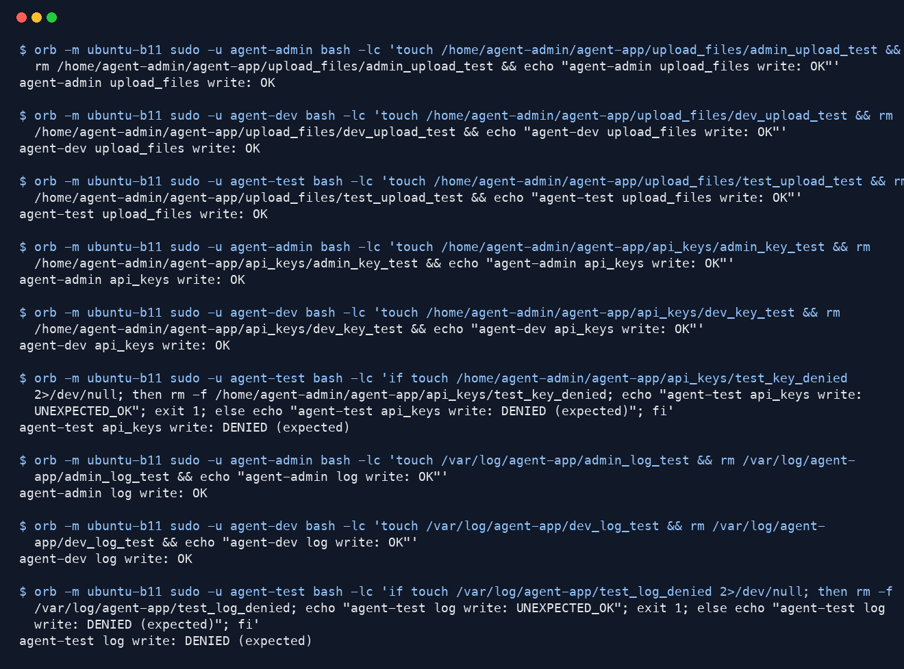

원문 증거 로그:

- `evidence/07_access_permission_metadata_check.txt`
- `evidence/08_access_permission_write_tests.txt`

### 3. 애플리케이션 실행 환경 구성

#### 3.1 환경 변수

##### 3.1.1 수행 내역

1. `uname -m`으로 `ubuntu-b11`의 CPU 아키텍처가 `x86_64`인지 확인하였다.
2. `/Users/10hour0574/Downloads/pjt7ec757e6-0e57-48e9-9805-e1587f441508_agent-app.zip`에 제공 애플리케이션 zip 파일이 있는지 확인하였다.
3. `python3 -m zipfile -l`로 zip 내부에 `agent-app`과 `agent-app-linux-arm64`가 들어 있는 것을 확인하였다.
4. 현재 환경은 `x86_64`이므로 임의 앱을 만들지 않고 제공 파일 중 `agent-app`을 사용하기로 하였다.
5. `python3 -m zipfile -e`로 제공 zip을 `/tmp/b11-agent-app-extract`에 압축 해제하였다.
6. `sudo install -o agent-admin -g agent-core -m 750 /tmp/b11-agent-app-extract/agent-app /home/agent-admin/agent-app/agent-app`으로 제공 앱을 `AGENT_HOME` 아래에 배치하였다.
7. 제출 저장소에 `config/agent-app-env.sh` 파일을 작성하였다.
8. 환경 변수 파일에 `AGENT_HOME=/home/agent-admin/agent-app`을 등록하였다.
9. 환경 변수 파일에 `AGENT_PORT=15034`를 등록하였다.
10. 환경 변수 파일에 `AGENT_UPLOAD_DIR=$AGENT_HOME/upload_files`를 등록하였다.
11. 환경 변수 파일에 `AGENT_KEY_PATH=$AGENT_HOME/api_keys/t_secret.key`를 등록하였다.
12. 환경 변수 파일에 `AGENT_LOG_DIR=/var/log/agent-app`를 등록하였다.
13. `sudo install -o root -g root -m 644 config/agent-app-env.sh /etc/profile.d/agent-app.sh`로 시스템 로그인 셸에서 환경 변수가 자동 등록되도록 배포하였다.
14. `sudo cat /etc/profile.d/agent-app.sh`로 시스템에 등록된 환경 변수 파일 내용을 확인하였다.
15. `sudo -u agent-admin bash -lc ...`로 `agent-admin` 로그인 셸에서 환경 변수들이 실제 값으로 로드되는 것을 확인하였다.
16. `ls -l`로 제공 앱 파일, 업로드 디렉터리, 키 디렉터리, 로그 디렉터리가 환경 변수 경로와 맞는지 확인하였다.
17. `test -x "$AGENT_HOME/agent-app"`로 제공 앱 파일이 실행 가능 상태인지 확인하였다.

##### 3.1.2 주요 개념

- 환경 변수란? 프로그램 실행 시 필요한 경로, 포트, 설정값을 코드 밖에서 전달하기 위한 값이다.
- `/etc/profile.d`란? 로그인 셸이 시작될 때 공통 환경 설정 스크립트를 읽는 디렉터리이다.
- `AGENT_HOME`이란? 앱 실행 파일과 관련 디렉터리를 찾기 위한 기준 경로이다.

##### 3.1.3 확인 결과

- 제공 앱 zip 사용 확인: `pjt7ec757e6-0e57-48e9-9805-e1587f441508_agent-app.zip`
- 선택한 앱 파일: `agent-app` (`x86_64` 환경 기준)
- 앱 배치 경로: `/home/agent-admin/agent-app/agent-app`
- 환경 변수 등록 파일: `/etc/profile.d/agent-app.sh`
- `AGENT_HOME`: `/home/agent-admin/agent-app`
- `AGENT_PORT`: `15034`
- `AGENT_UPLOAD_DIR`: `/home/agent-admin/agent-app/upload_files`
- `AGENT_KEY_PATH`: `/home/agent-admin/agent-app/api_keys/t_secret.key`
- `AGENT_LOG_DIR`: `/var/log/agent-app`
- `agent-admin` 로그인 셸에서 환경 변수가 정상적으로 로드됨
- 키 파일 자체는 다음 단계에서 생성할 예정이며, 이번 단계에서는 키 파일 경로 환경 변수를 먼저 고정함

##### 3.1.4 증거 자료

제공 앱 zip 확인, 환경 변수 등록 파일, `agent-admin` 계정의 환경 변수 로드 확인:

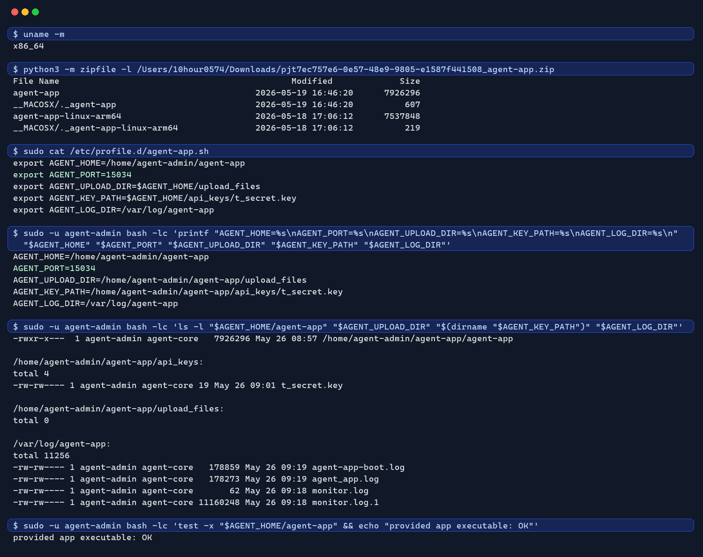

원문 증거 로그:

- `evidence/09_agent_environment_variables_check.txt`

#### 3.2 키 파일 생성

##### 3.2.1 수행 내역

1. `sudo -u agent-admin bash -lc 'printf "%s\n" "$AGENT_KEY_PATH"'`로 환경 변수에 등록된 키 파일 경로를 확인하였다.
2. `test -f /home/agent-admin/agent-app/api_keys/t_secret.key`로 기존 키 파일 존재 여부를 확인하였다.
3. 키 파일이 아직 존재하지 않는 것을 확인하였다.
4. `sudo -u agent-admin bash -lc 'printf "agent_api_key_test\n" > "$AGENT_KEY_PATH"'`로 키 파일을 생성하였다.
5. `sudo chown agent-admin:agent-core /home/agent-admin/agent-app/api_keys/t_secret.key`로 키 파일 소유자와 그룹을 지정하였다.
6. `sudo chmod 660 /home/agent-admin/agent-app/api_keys/t_secret.key`로 소유자와 `agent-core` 그룹만 읽고 쓸 수 있게 설정하였다.
7. `ls -l`로 키 파일의 소유자, 그룹, 권한을 확인하였다.
8. `wc -l`로 키 파일 내용이 1줄인지 확인하였다.
9. `cat`으로 키 파일 내용이 `agent_api_key_test`인지 확인하였다.
10. `agent-admin` 계정에서 `test "$(cat "$AGENT_KEY_PATH")" = "agent_api_key_test"`로 앱 실행 계정 기준에서도 내용 검증이 되는지 확인하였다.

##### 3.2.2 주요 개념

- 키 파일이란? 앱이 실행될 때 인증 값이나 비밀 값을 파일로 읽을 수 있도록 저장한 파일이다.
- `chmod 660`이란? 소유자와 그룹에는 읽기/쓰기 권한을 주고, 기타 사용자에게는 권한을 주지 않는 설정이다.
- `wc -l`이란? 파일의 줄 수를 확인하는 명령으로, 이번에는 키 값이 한 줄로 저장되었는지 확인하는 데 사용하였다.

##### 3.2.3 확인 결과

- 키 파일 경로: `/home/agent-admin/agent-app/api_keys/t_secret.key`
- 키 파일 내용: `agent_api_key_test`
- 줄 수: `1`
- 소유자/그룹: `agent-admin:agent-core`
- 권한: `-rw-rw----`
- `agent-admin` 계정 기준으로 환경 변수 경로와 실제 키 파일 내용이 일치함

##### 3.2.4 증거 자료

키 파일 경로, 권한, 줄 수, 내용 확인:

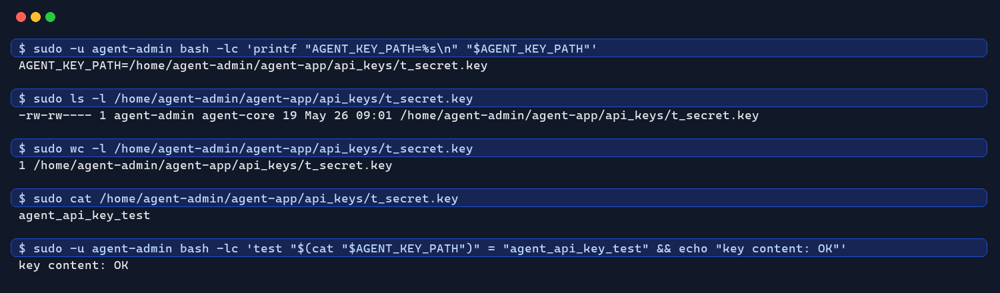

원문 증거 로그:

- `evidence/10_key_file_check.txt`

#### 3.3 앱 실행 및 성공 기준

##### 3.3.1 수행 내역

1. `pgrep -a -u agent-admin -f agent-app`로 기존 앱 프로세스가 실행 중인지 확인하였다.
2. `ss -tulnp | grep ':15034'`로 앱 포트가 이미 사용 중인지 확인하였다.
3. 실행 중인 앱 프로세스와 `15034` 리슨 포트가 없는 것을 확인하였다.
4. `sudo -u agent-admin bash -lc 'ls -l "$AGENT_HOME/agent-app"; env | grep ^AGENT_ | sort'`로 실행 파일과 환경 변수를 다시 확인하였다.
5. `agent-admin` 일반 계정으로 `AGENT_HOME` 디렉터리에서 제공 앱을 실행하였다.
6. 앱 실행 출력은 `/var/log/agent-app/agent-app-boot.log`에 저장하였다.
7. `agent-app.pid` 파일을 생성하여 실행 중인 앱 PID를 확인할 수 있게 하였다.
8. `sed -n "1,14p" "$AGENT_LOG_DIR/agent-app-boot.log"`로 Boot Sequence 출력 내용을 확인하였다.
9. Boot Sequence 5단계가 모두 `[OK]`인지 확인하였다.
10. 마지막에 `All Boot Checks Passed!`와 `Agent READY`가 출력되는 것을 확인하였다.
11. `pgrep -a -u agent-admin -f agent-app`로 앱이 `agent-admin` 계정에서 실행 중인지 확인하였다.
12. `ps -o user:20,pid,ppid,comm,args -u agent-admin`으로 프로세스 실행 사용자가 root가 아닌 `agent-admin`임을 확인하였다.
13. `sudo ss -tulnp | grep ':15034'`로 앱이 `0.0.0.0:15034`에서 LISTEN 상태인지 확인하였다.
14. 이후 `monitor.sh` 검증 단계에서 사용할 수 있도록 앱을 종료하지 않고 실행 상태로 유지하였다.

##### 3.3.2 주요 개념

- Boot Sequence란? 앱이 실행되기 전에 계정, 환경 변수, 파일, 포트, 로그 권한을 순서대로 점검하는 초기 확인 과정이다.
- LISTEN 상태란? 프로세스가 특정 포트에서 외부 접속을 받을 준비가 된 상태이다.
- 일반 계정 실행이란? root가 아닌 서비스용 사용자로 앱을 실행하여 권한 범위를 줄이는 운영 방식이다.

##### 3.3.3 확인 결과

- 실행 계정: `agent-admin`
- root 실행 여부: root가 아닌 일반 계정 실행 확인
- Boot Sequence 결과: 5단계 모두 `[OK]`
- 최종 준비 메시지: `Agent READY`
- 앱 리슨 주소: `0.0.0.0:15034`
- 실행 파일: `/home/agent-admin/agent-app/agent-app`
- 실행 로그: `/var/log/agent-app/agent-app-boot.log`
- 앱 종료는 foreground 실행 시 `Ctrl+C`로 가능하지만, 이번 단계에서는 다음 관제 스크립트 검증을 위해 백그라운드 실행 상태를 유지하였다.

##### 3.3.4 증거 자료

Boot Sequence, 일반 계정 실행, `15034` 포트 LISTEN 확인:

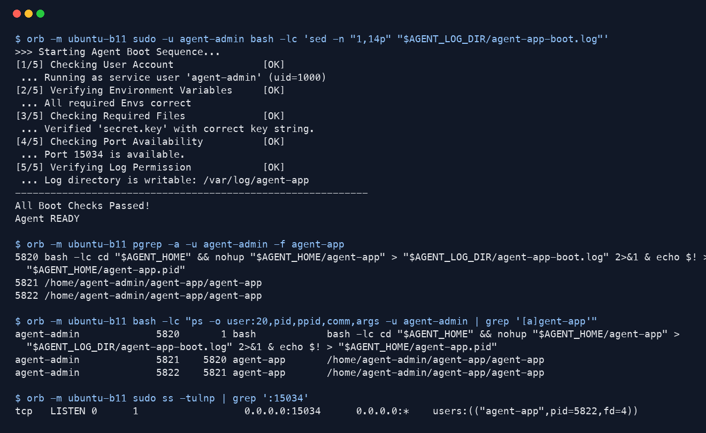

원문 증거 로그:

- `evidence/11_agent_run_success_check.txt`

### 4. 시스템 관제 자동화 스크립트(monitor.sh) 구현

#### 4.1 수행 내역

1. 제출용 소스 파일로 저장소 루트에 `monitor.sh`를 작성하였다.
2. 스크립트 상단에서 `/etc/profile.d/agent-app.sh`를 읽어 cron 환경에서도 `AGENT_HOME`, `AGENT_PORT`, `AGENT_LOG_DIR` 값을 사용할 수 있게 하였다.
3. 프로세스 Health Check는 `pgrep -u agent-admin -x agent-app`으로 구현하였다.
4. 앱 프로세스가 없으면 `[ERROR] agent-app process is not running`을 출력하고 `exit 1`로 종료하도록 하였다.
5. 포트 Health Check는 `ss -tuln`으로 TCP `15034` LISTEN 상태를 확인하도록 구현하였다.
6. 포트가 LISTEN 상태가 아니면 `[ERROR] TCP 15034 is not LISTEN`을 출력하고 `exit 1`로 종료하도록 하였다.
7. 방화벽 상태 점검은 UFW 설정 파일의 `ENABLED=yes`를 확인하는 방식으로 구현하였다.
8. 방화벽이 비활성 상태이면 `[WARNING]`만 출력하고 스크립트는 계속 실행되도록 하였다.
9. CPU 사용률은 `/proc/stat`을 두 번 읽어 전체 CPU 사용 비율을 계산하도록 구현하였다.
10. 메모리 사용률은 `free` 명령으로 계산하였다.
11. 루트 파티션 디스크 사용률은 `df /` 명령으로 수집하였다.
12. CPU `20%`, MEM `10%`, DISK `80%` 초과 시 `[WARNING]`을 출력하도록 구현하였다.
13. 수집 결과는 `/var/log/agent-app/monitor.log`에 `[YYYY-MM-DD HH:MM:SS] PID:... CPU:..% MEM:..% DISK_USED:..%` 형식으로 누적 기록하도록 하였다.
14. `$AGENT_HOME/bin` 디렉터리를 생성하였다.
15. `monitor.sh`를 `$AGENT_HOME/bin/monitor.sh`에 설치하였다.
16. 소유자는 `agent-dev`, 그룹은 `agent-core`, 권한은 `750`으로 설정하였다.
17. `agent-admin`이 `agent-core`에 포함되어 있으므로 cron 실행 계정 기준에서도 실행 가능한지 확인하였다.
18. `agent-admin` 계정으로 `monitor.sh`를 직접 실행하여 Health Check, 자원 수집, 로그 기록이 정상 동작하는지 확인하였다.
19. `tail -n 5 /var/log/agent-app/monitor.log`로 로그가 누적되는 것을 확인하였다.
20. logrotate 설정 파일 `config/agent-app-monitor.logrotate`를 작성하였다.
21. 해당 설정을 `/etc/logrotate.d/agent-app-monitor`에 배포하였다.
22. `size 10M`, `rotate 10`, `copytruncate` 설정으로 `monitor.log`가 10MB를 넘으면 최대 10개까지 보관되도록 하였다.
23. `monitor.sh`를 반복 실행한 뒤 같은 로그 포맷의 샘플 라인을 추가하여 `monitor.log`를 10MB 이상으로 크게 만들었다.
24. `logrotate -v /etc/logrotate.d/agent-app-monitor`를 실행하여 `monitor.log.1`로 회전되고 기존 `monitor.log`가 비워지는 것을 확인하였다.

#### 4.2 핵심 내용

이번 스크립트에서 가장 핵심이라고 생각한 부분은 Health Check와 경고 항목을 분리한 것이다. 프로세스와 포트는 앱이 정상 서비스 중인지 판단하는 필수 조건이므로 실패하면 `exit 1`로 종료하게 하였고, 방화벽 상태나 CPU/MEM/DISK 임계값은 운영자가 참고해야 하는 상태 정보이므로 `[WARNING]`만 출력하고 계속 로그를 남기도록 하였다.

#### 4.3 확인 결과

- 파일 경로: `/home/agent-admin/agent-app/bin/monitor.sh`
- 소유자/그룹: `agent-dev:agent-core`
- 권한: `750` (`rwxr-x---`)
- cron 실행 예정 계정: `agent-admin`
- `agent-admin` 실행 권한: 확인 완료
- 프로세스 Health Check: `agent-app` 확인 완료
- 포트 Health Check: `15034` LISTEN 확인 완료
- 방화벽 상태 점검: UFW `[OK]`
- 자원 수집: CPU, MEM, DISK_USED 출력 확인
- 로그 파일: `/var/log/agent-app/monitor.log`
- 로그 포맷: `[YYYY-MM-DD HH:MM:SS] PID:... CPU:..% MEM:..% DISK_USED:..%`
- 로그 용량 관리: logrotate로 `10MB`, `10개` 보관 설정 및 회전 확인

#### 4.4 로그 파일 용량 관리

로그 용량 관리는 스크립트 안에서 직접 구현하지 않고, 리눅스에서 일반적으로 사용하는 `logrotate`를 사용하였다. 설정 파일에는 `size 10M`과 `rotate 10`을 넣어 `monitor.log`가 10MB 이상이면 회전하고 최대 10개 파일만 유지하도록 하였다. 실제 검증에서는 `monitor.sh`를 반복 실행한 뒤 로그 파일을 10MB 이상으로 크게 만들고, `logrotate -v` 실행 결과 `monitor.log.1`이 생성되고 기존 `monitor.log`가 다시 작아지는 것을 확인하였다.

#### 4.5 증거 자료

`monitor.sh` 파일 위치, 소유자, 그룹, 권한 및 주요 코드 확인:

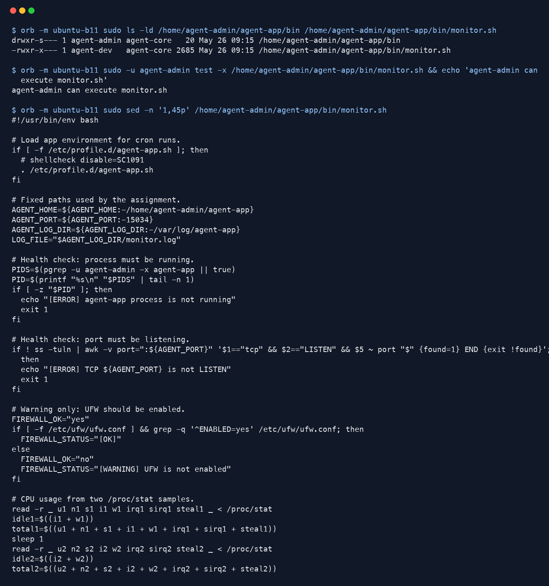

`monitor.sh` 실행 결과 및 `monitor.log` 누적 확인:

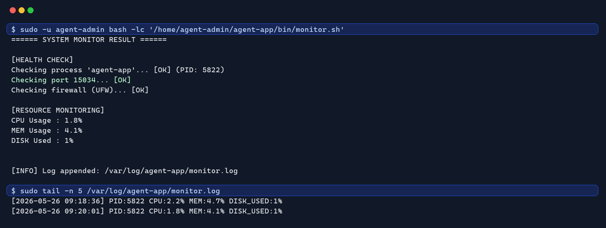

logrotate 설정, 10MB 초과 로그 생성, 회전 결과 확인:

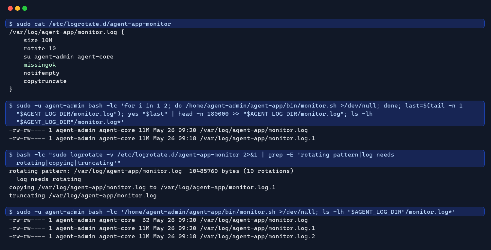

원문 증거 로그:

- `evidence/12_monitor_file_policy_check.txt`
- `evidence/13_monitor_execution_check.txt`
- `evidence/14_monitor_logrotate_check.txt`

### 5. 자동 실행(cron) 설정

#### 5.1 수행 내역

1. `command -v cron`으로 cron 데몬 실행 파일이 있는지 확인하였다.
2. `command -v crontab`으로 crontab 명령이 있는지 확인하였다.
3. `systemctl is-active cron`으로 cron 서비스가 실행 중인지 확인하였다.
4. `systemctl is-enabled cron`으로 cron 서비스가 부팅 시 자동 실행되도록 설정되어 있는지 확인하였다.
5. `sudo -u agent-admin crontab -l`로 `agent-admin` 계정의 기존 crontab을 확인하였다.
6. 기존에는 `agent-admin` 계정에 등록된 crontab이 없는 것을 확인하였다.
7. `agent-admin` 계정의 crontab에 `* * * * * /home/agent-admin/agent-app/bin/monitor.sh >/dev/null 2>&1`을 등록하였다.
8. `sudo -u agent-admin crontab -l`로 매분 실행 규칙이 등록되었는지 확인하였다.
9. 등록 직후 `/var/log/agent-app/monitor.log`의 줄 수와 마지막 줄을 확인하였다.
10. 1분 이상 기다린 뒤 `/var/log/agent-app/monitor.log`의 줄 수가 증가했는지 확인하였다.
11. `tail -n 5 /var/log/agent-app/monitor.log`로 `09:25`, `09:26`, `09:27`처럼 분 단위 로그가 자동 누적되는 것을 확인하였다.

#### 5.2 cron 문법

cron은 정해진 시간마다 명령을 자동 실행하는 리눅스 작업 예약 기능이다. crontab 한 줄은 보통 `분 시 일 월 요일 명령어` 순서로 작성한다. 이번에 사용한 `* * * * *`는 다섯 자리 모두 `*`이므로 “매분, 매시간, 매일, 매월, 모든 요일”에 실행한다는 뜻이다. 뒤의 `/home/agent-admin/agent-app/bin/monitor.sh >/dev/null 2>&1`은 `monitor.sh`를 실행하되, cron 실행 출력은 따로 화면에 남기지 않도록 버리는 설정이다.

#### 5.3 확인 결과

- cron 서비스 상태: `active`
- cron 자동 시작 상태: `enabled`
- cron 실행 계정: `agent-admin`
- 등록한 crontab:
  `* * * * * /home/agent-admin/agent-app/bin/monitor.sh >/dev/null 2>&1`
- 실행 주기: 매분
- 자동 실행 결과: `monitor.log`에 새 라인 자동 누적 확인
- 확인된 자동 로그 예시:
  - `[2026-05-26 09:25:02] ...`
  - `[2026-05-26 09:26:02] ...`
  - `[2026-05-26 09:27:02] ...`

#### 5.4 증거 자료

cron 서비스 상태, `agent-admin` crontab 등록, `monitor.log` 자동 누적 확인:

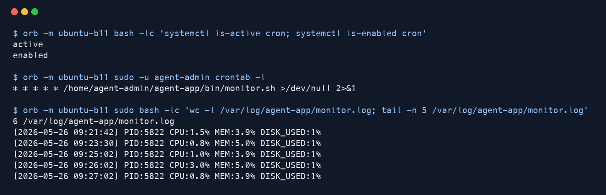

원문 증거 로그:

- `evidence/15_cron_auto_execution_check.txt`
